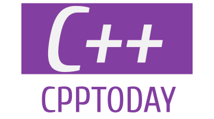

# CppToday

[](https://github.com/aafulei/cpp-today/actions/workflows/check.yml)
[](https://github.com/aafulei/cpp-today/actions/workflows/build.yml)
[](https://github.com/aafulei/cpp-today/actions/workflows/test.yml)



*A minimal but complete Make-based C++23 project template.*

This project packages a simple C++23 command-line program with essential tools
and workflows for building, testing, and maintaining the code. The program
prints the current date in the `YY/MM/DD = Www` format (e.g. `25/05/14 = Wed`).

Project website:
[**aafulei.github.io/cpp-today**](https://aafulei.github.io/cpp-today).

- [Features](#features)
- [Supported Platforms](#supported-platforms)
- [Getting Started](#getting-started)
- [Project Structure](#project-structure)
- [Project Website](#project-website)
- [Author](#author)
- [License](#license)
- [Version](#version)
- [Changelog](#changelog)

## Features

- Minimal, complete C++23 project template
- All-in-one Make-based build system
- Test scripts for manual and automated testing
- Code formatting support with Clang Format
- Editor tooling support via Clangd
- Built-in CI/CD workflows using GitHub Actions
- Project documentation website built with MkDocs
- Source code documentation generated with Doxygen
- Software documentation in GNU-style man page

## Supported Platforms

- macOS
- Linux

## Getting Started

### Download

Download pre-built binaries and the accompanying man page from the
[Release](https://github.com/aafulei/cpp-today/releases) page.

Alternatively, you can build the program from source as shown below.

### Build

Clone the [GitHub repository](https://github.com/aafulei/cpp-today). Then use
`make` to build the program:

```shell
make
```

### Run

- If you downloaded the binary from the
[Release](https://github.com/aafulei/cpp-today/releases) page, follow the
instructions there.

- If you built the program yourself using `make`, you can run it with:

    ```shell
    make run
    ```

    Alternatively, to run manually:

    ```shell
    ./bin/release/today
    ```

You should see the current date printed out in the `YY/MM/DD = Www` format, for
example:

```
25/05/14 = Wed
```

### Install

To install the program, run:

```shell
make install
```

The `man` page will be installed alongside the program. You might need `sudo`
privileges. Run `make help` for customization options. To install the
binary and the man page manually, copy them to their default destinations or to
directories of your choice:

| Source                | Default Destination          |
| --------------------- | ---------------------------- |
| `./bin/release/today` | `/usr/local/bin/`            |
| `./docs/man/today.1`  | `/usr/local/share/man/man3/` |

To uninstall the program and the man page, run:

```shell
make uninstall
```

### Ask for Help

As is typical with command-line programs, run:

```shell
today --help
```

for help. If the man page has been installed, you can run:

```shell
man today
```

to view the manual page for more information.

*For detailed user guides, please visit the project website
 [**aafulei.github.io/cpp-today**](https://aafulei.github.io/cpp-today).*

## Project Structure

- [`.github/workflows/`](./.github/workflows/) — GitHub Actions workflows
- [`docs/`](./docs/) — project documentation files and assets
    - [`css/`](./docs/css/) — custom CSS files for MkDocs and Doxygen
    - [`img/`](./docs/img/) — image files
    - [`man/`](./docs/man/) - man page files
    - [`mermaid/`](./docs/mermaid/) - source files for Mermaid diagrams
    - `.md` files - source files for MkDocs to generate the project website
- [`src/`](./src/) — source code
- [`tests/`](./tests/) — test scripts
- [`.clang-format`](./.clang-format) — Clang Format configuration
- [`.gitignore`](./.gitignore) — Git ignore patterns
- [`CHANGELOG.md`](./CHANGELOG.md) — changelog
- [`Doxyfile`](./Doxyfile) — Doxygen configuration file
- [`DoxygenLayout.xml`](./DoxygenLayout.xml) — Doxygen website layout
- [`LICENSE`](./LICENSE) — license file
- [`Makefile`](./Makefile) — Make build script
- [`README.md`](./README.md) — repository documentation (this file)
- [`VERSION`](./VERSION) - version file
- [`compile_flags.txt`](./compile_flags.txt) — Clangd compile options
- [`mkdocs.yml`](./mkdocs.yml) — MkDocs project website configuration

## Project Website


As illustrated in the above diagram, information about this project is presented
to users and developers in three distinct locations, each serving a specific
purpose:

| Location                                                                  | Provides                              |
| ------------------------------------------------------------------------- | ------------------------------------- |
| [GitHub repository](https://github.com/aafulei/cpp-today)                 | source code and project configuration |
| [MkDocs website](https://aafulei.github.io/cpp-today)                     | detailed users guides                 |
| [Doxygen documentation](https://aafulei.github.io/cpp-today/doxygen/html) | detailed code reference               |

## Author

Aaron Fu Lei

## License

MIT

## Version

0.3.0

## Changelog

For detailed version updates, please see the [CHANGELOG](./CHANGELOG.md).
