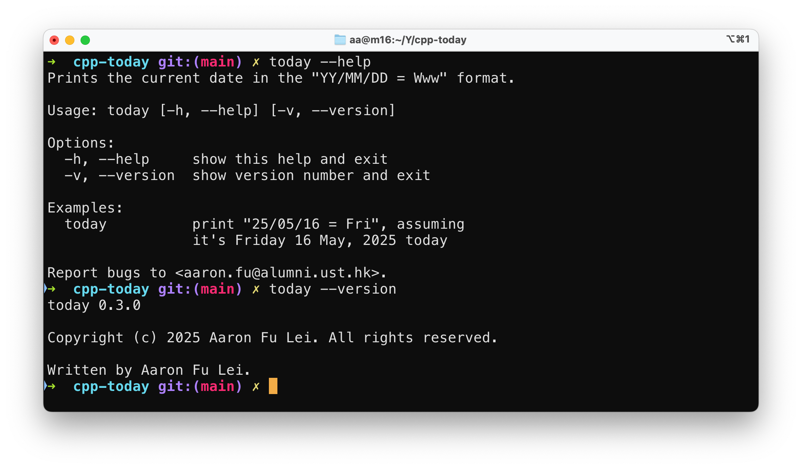
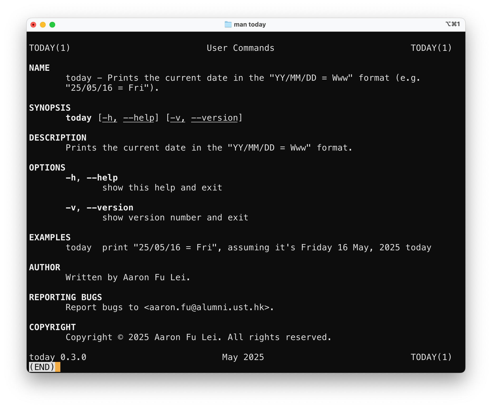

# Single Source of Truth

Software evolves over time.  When multiple parts of a project refer to the same
piece of information, such as version numbers or help texts, it is crucial that
these references remain consistent and update simultaneously. This project
maintains a single source of truth for key information including:

- Software version
- Software help

## Software Version

The definitive source for the current software version is the
[`VERSION`](https://github.com/aafulei/cpp-today/blob/main/VERSION) file
located at the root of the repository. This file contains only the version
string, for example

```text
0.3.0
```

During the build process, the
[`Makefile`](https://github.com/aafulei/cpp-today/blob/main/Makefile)
dynamically injects this version string into the source code by defining the
`VERSION` macro. This ensures the version information is embedded consistently
throughout the software.

Users can verify the version at runtime by running


```shell
today --version
```

which outputs

```
today 0.3.0

Copyright (c) 2025 Aaron Fu Lei. All rights reserved.

Written by Aaron Fu Lei.
```

This version information is also reflected in the manual pages. For example, the
footer of the `man today` page shows the version number, like

```
today 0.2.0          May 2025          TODAY(1)
```

Additionally, the Make build system provides a convenient target to display the
current version

```shell
make show-version
```

which outputs

```
% ================
% Software Version
% ================

0.3.0
```

This approach guarantees that the version number remains synchronized across all
user-facing outputs and documentation.

## Software Help

The help information is embedded directly in the
[`today.cpp`](https://github.com/aafulei/cpp-today/blob/main/src/today.cpp)
source file as the single source of truth. This ensures consistency between the
command-line help output and the manual page.

When users run

```shell
today --help
```

the program prints the embedded help message.



The same help text, combined with the version output (`today --version`) is
piped to the[`help2man`](https://www.gnu.org/software/help2man/) tool to
automatically generate the man page.



This generation is integrated into the Make build system and can be triggered
with

```shell
make man
```

which runs

```shell
help2man \
--name="$(cat ./docs/man/desc.txt)" \
--no-info \
--output=./docs/man/today.1 \
./bin/release/today
```

under the hood, where
[`docs/man/desc.txt`](https://github.com/aafulei/cpp-today/blob/main/docs/man/desc.txt)
is a one-line description for the name section of the man page.

By using this approach, the project avoids duplicating help content and keeps
all user-facing documentation synchronized effortlessly.

---

*For source code and project files, please see the
[GitHub repository](https://github.com/aafulei/cpp-today).*
